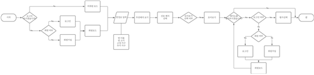
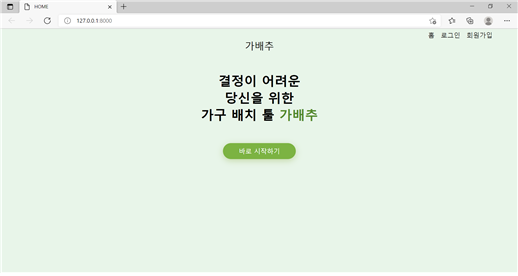

*🎈 가 배 추 🎈*
==============
#### 단국대학교 컴퓨터공학과 캡스톤디자인  🥔 1조 말하는 감자 🥔

-----

### 가구 배치 프로그램

  

#### 1️⃣ 가배추란⁉
> 사용자에게 __최적의 상태로 가구를 배치하여 추천__ 해주는 시스템
  
#  
#### 2️⃣ 기대효과
1. __편리성__ 제공

2. 인테리어 초보자의 __니즈 충족__

#
#### 3️⃣ 개발환경
> 백엔드  :  __*Django*__
> 
> 프론트엔드 : __*HTML, CSS*__
> 
> 
#
#### 4️⃣Flow chart

#

#### 5️⃣실행 화면

